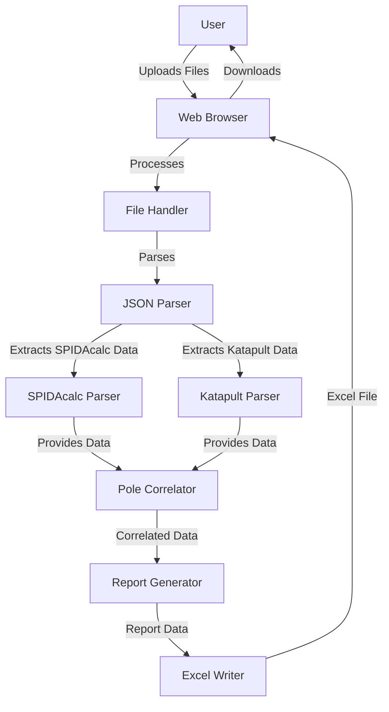

# Architecture Overview

## System Architecture

The Make-Ready Report Generator is a client-side web application designed to run entirely in the browser. This architecture eliminates the need for server-side processing, allowing users to process potentially sensitive utility data without uploading it to external servers.

## Core Components

### File Handler (`file-handler.js`)
- Manages file uploads through traditional form and drag-and-drop
- Validates file types and provides feedback
- Reads file contents and passes to JSON parser

### JSON Parser (`json-parser.js`)
- Provides utility functions for safely navigating JSON structures
- Handles unit conversions between metric and imperial systems
- Contains reusable lookup functions

### SPIDAcalc Parser (`spida-parser.js`)
- Extracts relevant data from SPIDAcalc JSON structure
- Navigates complex client data references
- Implements specialized extraction for each data field

### Katapult Parser (`katapult-parser.js`)
- Extracts relevant data from Katapult JSON structure
- Handles dynamic keys and attribute structures
- Processes photo and measurement data

### Pole Correlator (Part of `report-generator.js`)
- Matches poles between SPIDAcalc and Katapult data
- Implements multi-stage matching with confidence scoring
- Handles unmatched poles and partial matches

### Report Generator (`report-generator.js`)
- Orchestrates the full report generation process
- Manages the column mapping and data integration
- Formats data according to report specifications

### Excel Writer (`excel-writer.js`)
- Creates Excel workbooks using SheetJS library
- Formats cells and columns appropriately
- Triggers file download

## Data Flow

1. **Input**: User uploads SPIDAcalc and/or Katapult JSON files
2. **Parsing**: Files are parsed into JavaScript objects
3. **Correlation**: Poles are matched between data sources
4. **Extraction**: Data fields are extracted from both sources according to mapping rules
5. **Assembly**: Report data structure is created with all required columns
6. **Output**: Excel file is generated and downloaded

## Data Handling

### SPIDAcalc Data Handling
- SPIDAcalc data follows a hierarchical structure
- Pole designs are found in `project.leads[*].locations[*].designs[*]`
- Client data definitions (pole types, wire types, etc.) are in `clientData`
- Unit conversion is required (SPIDAcalc uses metric units)

### Katapult Data Handling
- Katapult data is organized around nodes, connections, and traces
- Node attributes contain key pole data with dynamic keys
- Photo data includes photogrammetry measurements
- Trace data defines ownership and connectivity information
